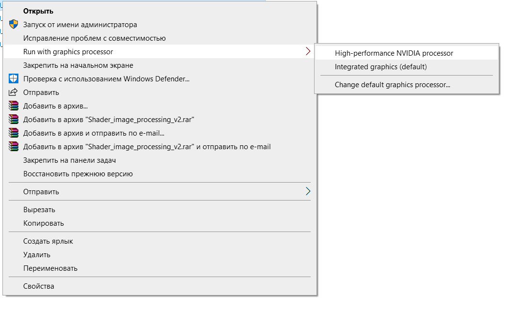
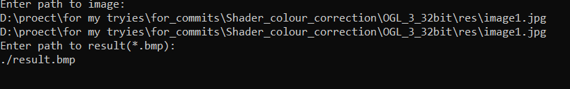
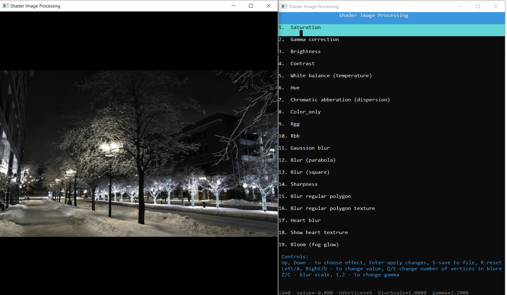
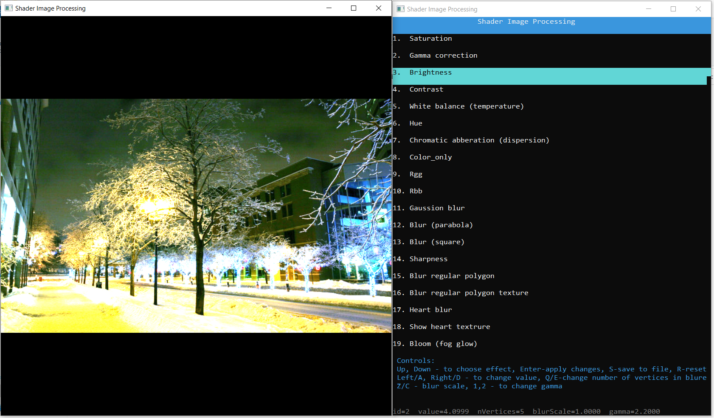
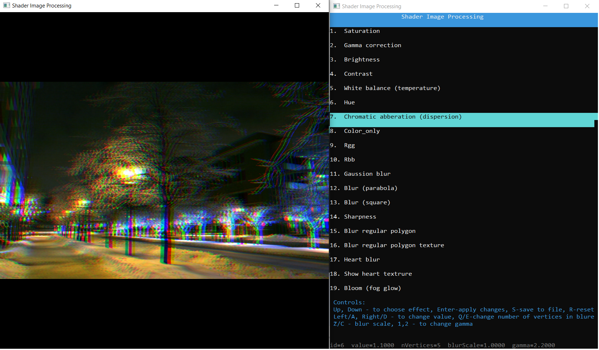
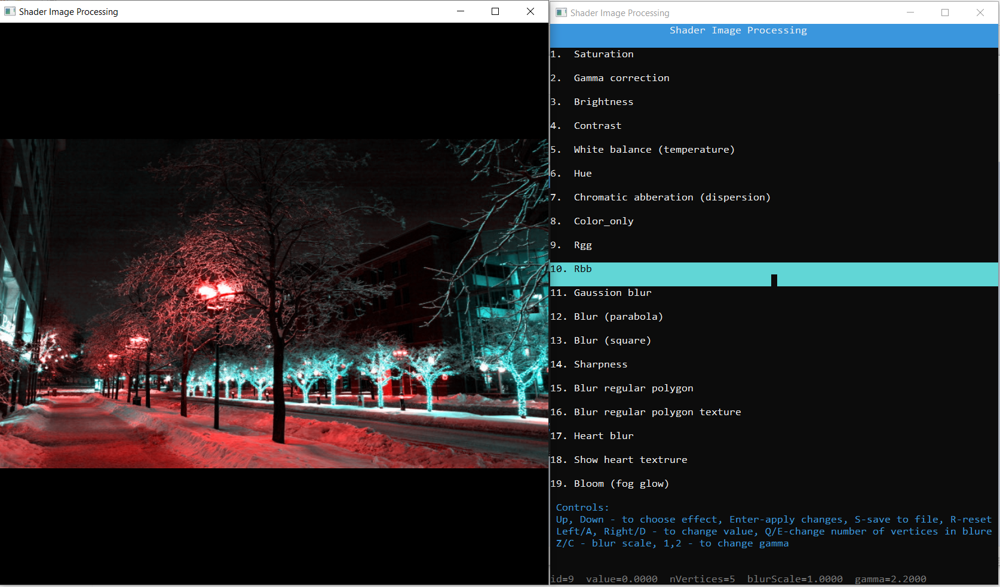
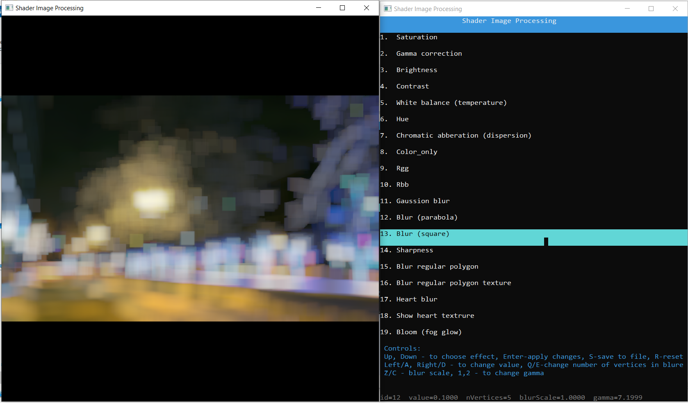
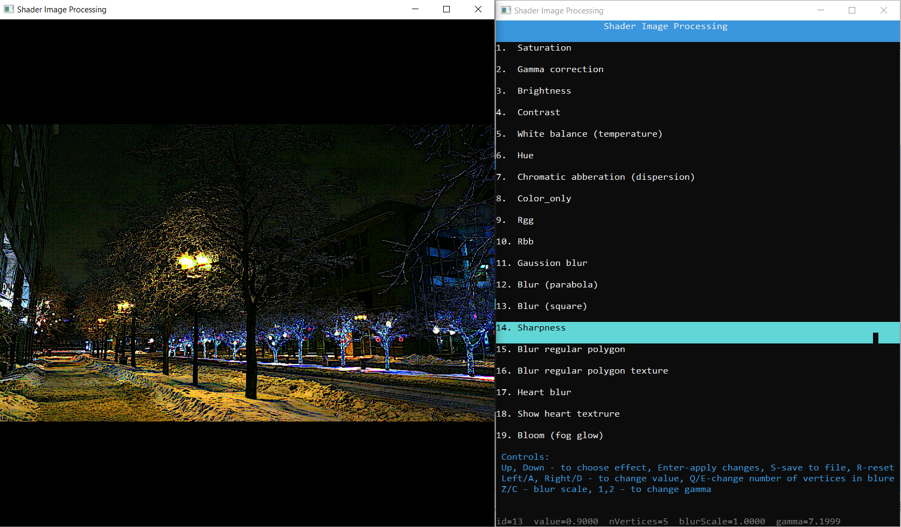
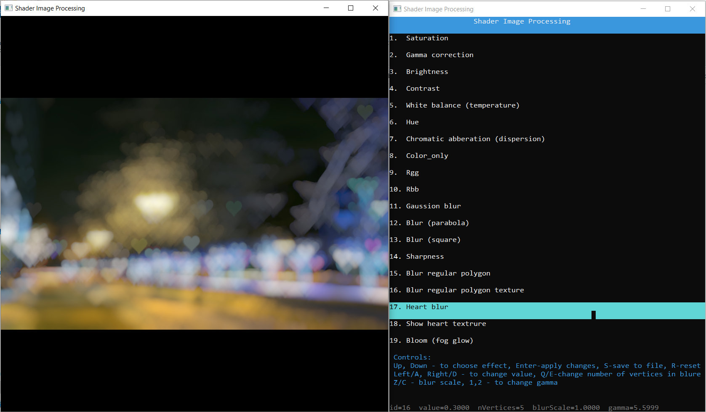
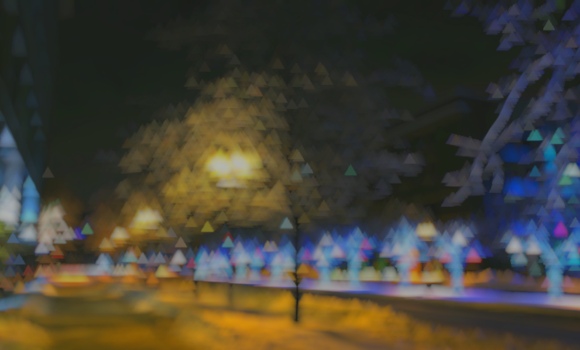

# Shader image processing
## Description
This program was created as a project for the discipline of "Program Technology-2".

It's simple 2d desktop editor that can change your images with a power of your videocard.
#  
The program was writen with C++ using GLEW and GLFW (to use OpenGL), GLM and STB. To use it, you need a videocard that suport at least OpenGL v3.3.
## Possibilities
So far you can choose on of thise options to change your photo:
- Saturation
- Gamma correction
- Brightness
- Contrast
- White balance (temperature)
- Hue
- Chromatic abberation (dispersion)
- Sharpness
- Gaussian blur
- Blur, whith imitates aperture of camera with blades 
- Blur with heard ♥ shaped aperture hole)
- Fog glow
- And others
## Technical features
To make some changes to the photo, we are using shaders, all of them can be found in $/res/ dir.

Application works with jpg, png, bmp image formats, supports saving to file. The program does not overwright your existing photo so you can keep them both. 

Program consists of 1 main .cpp file which is mainWindowEventProcessing.cpp, and 3 majore .h files:
1. mainWindowEventProcessing.cpp - initialize glfw, creating window for photo, handle input, creates instances of the class imageProcessing and consoleEngine.
2. ImageProcessing.h - class for loading structure, implementing changes for photo, updating buffer, using shaders and saving to file.
3. ConsoleEngine.h - class for creating window for navigation through effects, and addjusting them.
4. Shader.h - class for uploading shaders, linking and compiling them, and installing in GPU.

## How to use?
1.Open Shader_image_processing_v2.exe, highly recommended to open it with your external videocard.
          

          
2.Type path to your image and type where you whant to save a result (pathes can be absolute and relative).
          

          
3.Navigate through console using your keyboard, to confirm changes type Enter, to save your file type S.

## Troubleshooting
1. Make sure that you have retargeted VS project after you cloned repos.

2. If some of blures doesn't work, you probably opened program with integrated videocard, try to choose external. (Problem was spoted on Radeon Vega 8).

3. If navigation keys doesn't work, choose your image as an active window.

4. If navigation window become crazy, just type some of navigation keys.

## Screenshots

      
Posible result:

