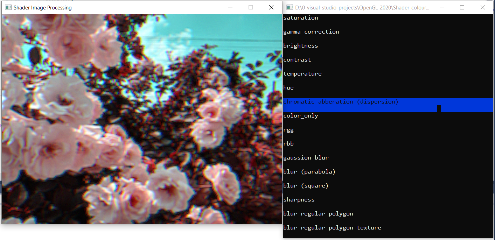

# Shader image processing
## Description
This program was created as a project for the discipline of "Program Technology-2".

It's simple 2d desktop editor that can change your images with a power of your videocard.
#  
The program was writen with C++ using GLEW and GLFW. To use it, you need a videocard that suport at least OpenGL v3.3.
## Possibilities
So far you can choose on of thise options to change your photo:
- Saturation
- Gamma correction
- Change brightness
- Change contrast
- Tritanotopia
## Technical features
To make some changes to the photo, we are using shader, all of tham can be found in $/res/ dir.

To choose another photo you need to rewrite path in src_main.cpp(will be changed asasp).

#
### This programm is still in development and more options will be added soon

## Screenshots command line mode

